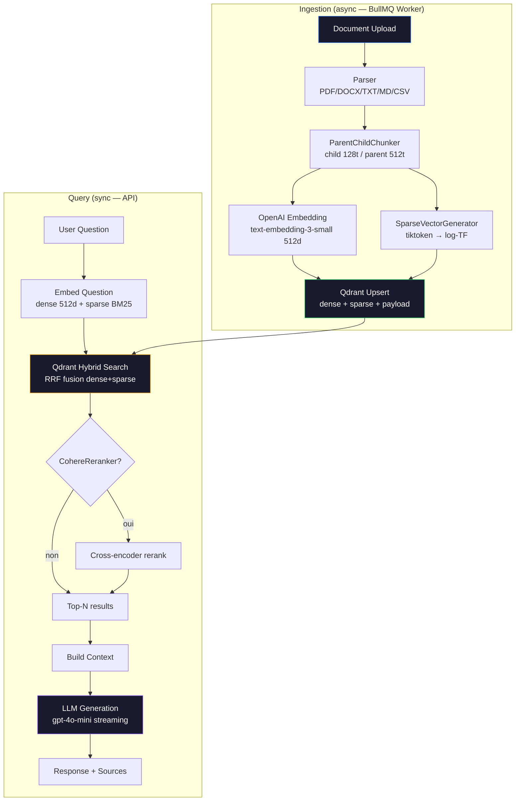
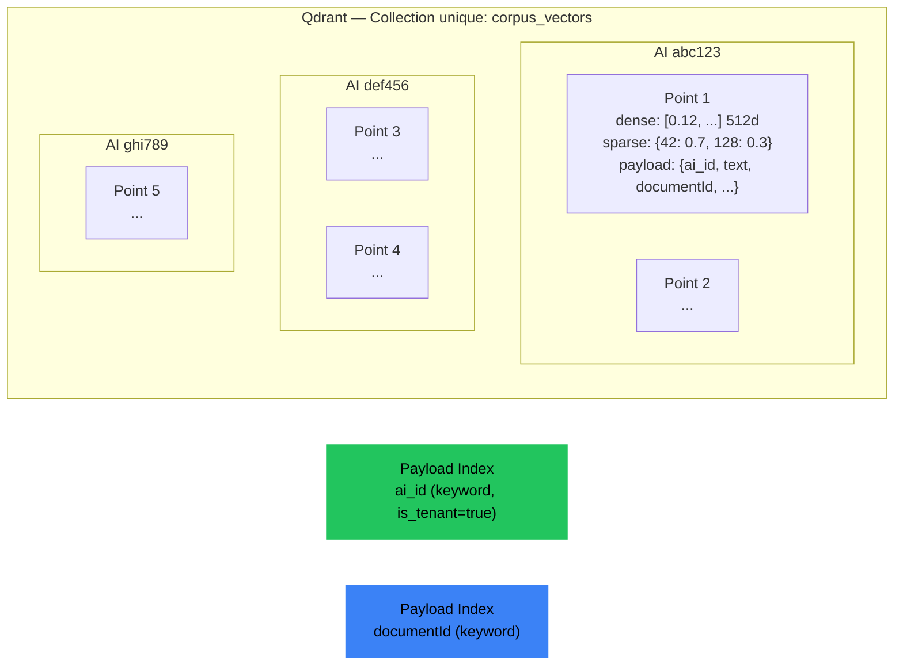
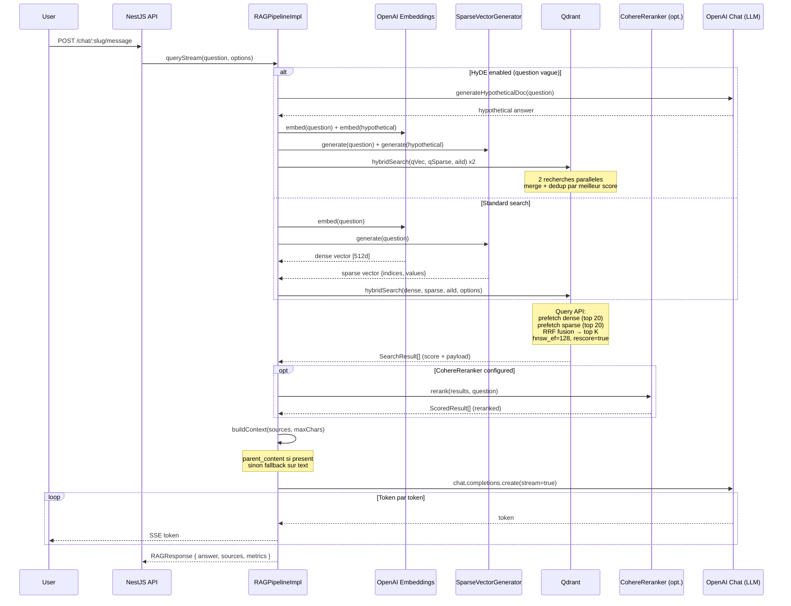
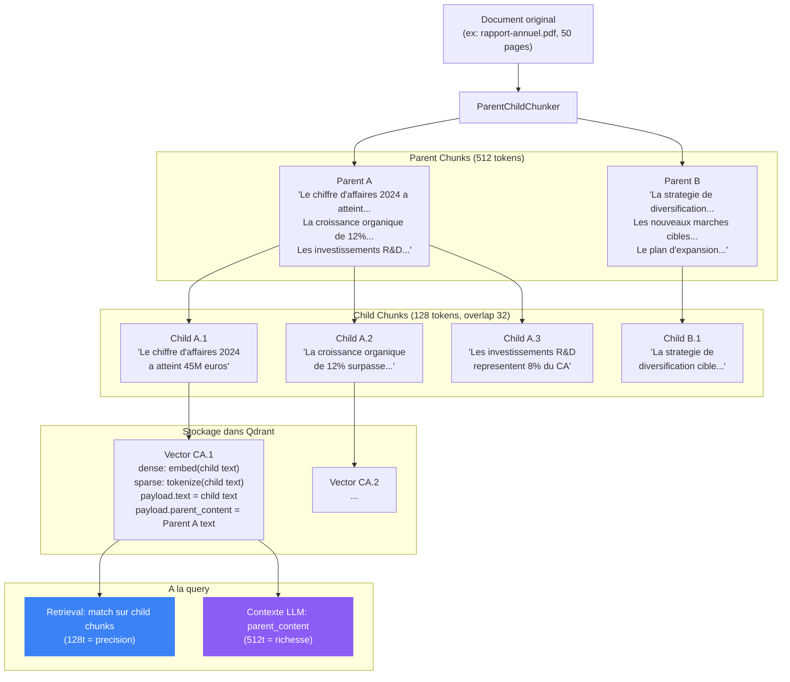
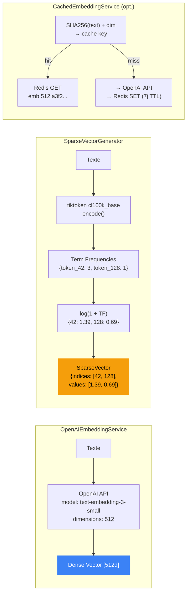
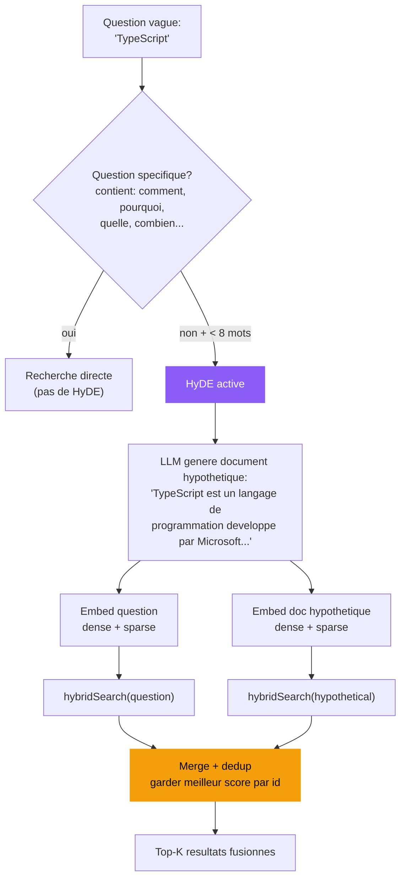

# RAG Pipeline Architecture — CorpusAI

## Vue d'ensemble



---

## Architecture Qdrant

### Collection globale multi-tenant



| Config             | Valeur                                            | Raison                                                                |
| ------------------ | ------------------------------------------------- | --------------------------------------------------------------------- |
| **Collection**     | `corpus_vectors` (unique, globale)                | Multi-tenancy via filtre `ai_id`, recommandation officielle Qdrant    |
| **Dense vectors**  | 512 dimensions, Cosine, `on_disk: true`           | Matryoshka text-embedding-3-small (3x moins de RAM, recall identique) |
| **Sparse vectors** | `modifier: 'idf'`                                 | BM25 natif Qdrant — IDF calculee server-side sur tout le corpus       |
| **HNSW**           | `m: 0`, `payload_m: 16`, `ef_construct: 128`      | Graphe per-tenant (pas de graphe global), haute qualite               |
| **Quantization**   | Scalar int8, `quantile: 0.99`, `always_ram: true` | 4x reduction memoire, <1% perte recall                                |
| **Indexes**        | `ai_id` (is_tenant), `documentId` (keyword)       | Filtre tenant quasi-gratuit, deletions rapides par document           |

---

## Flow d'indexation detaille

```mermaid
sequenceDiagram
    participant API as API / Worker
    participant Pipeline as RAGPipelineImpl
    participant Chunker as ParentChildChunker
    participant OpenAI as OpenAI API
    participant Sparse as SparseVectorGenerator
    participant Qdrant as Qdrant (corpus_vectors)

    API->>Pipeline: index(documents, { onProgress })
    Pipeline->>Qdrant: ensureCollection()
    Note over Qdrant: Cree collection si absente<br/>(dense+sparse, quantization, indexes)

    loop Pour chaque document
        Pipeline->>Qdrant: deleteByDocument(aiId, docId)
        Note over Qdrant: Supprime les anciens vecteurs<br/>(idempotent pour retry)
    end

    Pipeline->>Chunker: chunk(content, metadata)
    Note over Chunker: Child chunks: 128 tokens<br/>Parent chunks: 512 tokens<br/>Overlap: 32 tokens

    rect rgb(30, 30, 60)
        Note over Pipeline: Phase Embedding + Storing (par batch de 100)
        loop Pour chaque batch de 100 chunks
            Pipeline->>OpenAI: embedBatch(texts, dimensions=512)
            OpenAI-->>Pipeline: number[100][512]

            Pipeline->>Sparse: generateBatch(texts)
            Note over Sparse: tiktoken encode → term freqs → log(1+TF)
            Sparse-->>Pipeline: SparseVector[100]

            Pipeline->>Qdrant: upsert(hybridPoints, isLastBatch)
            Note over Qdrant: wait: false sauf dernier batch<br/>payload inclut ai_id
        end
    end

    Pipeline-->>API: IndexResult { chunksCreated, chunkIds }
```



### Structure d'un point Qdrant

```json
{
  "id": "doc1_chunk_3",
  "vector": {
    "dense": [0.12, -0.03, 0.87, ...],   // 512 dimensions
    "sparse": {
      "indices": [42, 128, 9325, 15002],  // Token IDs (tiktoken cl100k_base)
      "values": [0.693, 0.405, 1.099, 0.693]  // log(1 + term_frequency)
    }
  },
  "payload": {
    "ai_id": "cmn6irwmn0001msfd3n3yixov",
    "text": "Child chunk text (128 tokens, precise for retrieval)",
    "source": "rapport-annuel.pdf",
    "documentId": "doc_abc123",
    "chunkIndex": 3,
    "parent_content": "Parent chunk text (512 tokens, rich context for LLM)"
  }
}
```

---

## Flow de query detaille



---

## Hybrid Search — RRF Fusion

```mermaid
graph TB
    Q[Question: "contrat de travail"]

    subgraph "Dense Search (semantique)"
        D1[Embed question → 512d vector]
        D2[Cosine similarity dans HNSW per-tenant]
        D3["Top 20 resultats<br/>#1 score=0.89 'CDI et conditions'<br/>#2 score=0.85 'periode essai'<br/>#3 score=0.81 'clauses du contrat'"]
    end

    subgraph "Sparse Search (lexical BM25)"
        S1["Tokenize → {contrat: 0.69, travail: 0.69}"]
        S2[BM25 avec IDF server-side]
        S3["Top 20 resultats<br/>#1 score=12.3 'contrat de travail CDI'<br/>#2 score=10.1 'rupture contrat'<br/>#3 score=8.7 'droit du travail'"]
    end

    Q --> D1 --> D2 --> D3
    Q --> S1 --> S2 --> S3

    D3 --> RRF[Reciprocal Rank Fusion<br/>server-side dans Qdrant]
    S3 --> RRF

    RRF --> R["Top K fusionnes<br/>#1 'contrat de travail CDI' (dense #3 + sparse #1)<br/>#2 'CDI et conditions' (dense #1)<br/>#3 'rupture contrat' (sparse #2 + dense #7)"]

    style RRF fill:#f59e0b,stroke:#f59e0b,color:#000
```

**Pourquoi RRF natif Qdrant est meilleur que le HybridReranker precedent :**

| Aspect       | Ancien (HybridReranker client-side) | Nouveau (Qdrant RRF natif)        |
| ------------ | ----------------------------------- | --------------------------------- |
| BM25 scope   | Top-K seulement (5-10 docs)         | Tout le corpus (IDF global)       |
| Fusion       | Client-side, 2 roundtrips           | Server-side, 1 roundtrip          |
| Latence      | ~50ms overhead client               | ~0ms (fusionne dans Qdrant)       |
| Qualite BM25 | TF sans vrai IDF                    | TF-IDF complet via modifier `idf` |

---

## Parent-Child Chunking



**Principe** : les child chunks (128 tokens) sont utilises pour le retrieval vectoriel (precision), mais le LLM recoit le `parent_content` (512 tokens) qui fournit un contexte plus riche pour generer de meilleures reponses.

---

## Embedding Pipeline



### Matryoshka 512d vs 1536d

| Metrique            | 1536d (ancien)  | 512d (actuel)               |
| ------------------- | --------------- | --------------------------- |
| RAM par 1M vecteurs | ~6 GB           | ~2 GB                       |
| Avec scalar quant.  | ~1.5 GB         | ~0.5 GB                     |
| MTEB recall         | 62.3%           | ~61-62%                     |
| Cout API OpenAI     | $0.02/1M tokens | $0.02/1M tokens (identique) |
| Vitesse HNSW        | baseline        | ~2x plus rapide             |

---

## HyDE (Hypothetical Document Embeddings)



---

## Lifecycle des donnees

```mermaid
graph TB
    subgraph "Creation"
        C1["Nouveau document uploade"]
        C1 --> C2["BullMQ job: DOCUMENT_PROCESSING"]
        C2 --> C3["Worker: parse → chunk → embed → upsert"]
        C3 --> C4["Points dans corpus_vectors<br/>avec ai_id + documentId"]
    end

    subgraph "Suppression document"
        D1["DELETE /documents/:id"]
        D1 --> D2["vectorStore.deleteByDocument(aiId, docId)"]
        D2 --> D3["Qdrant filter:<br/>must: [ai_id=X, documentId=Y]"]
        D3 --> D4["Points supprimes"]
        D1 --> D5["Prisma: delete document + chunks"]
    end

    subgraph "Suppression AI"
        A1["DELETE /ais/:id"]
        A1 --> A2["vectorStore.deleteByAI(aiId)"]
        A2 --> A3["Qdrant filter:<br/>must: [ai_id=X]"]
        A3 --> A4["Tous les points de l'AI supprimes"]
        A1 --> A5["Prisma: cascade delete AI"]
    end

    style C4 fill:#22c55e,stroke:#22c55e,color:#000
    style D4 fill:#ef4444,stroke:#ef4444,color:#fff
    style A4 fill:#ef4444,stroke:#ef4444,color:#fff
```



---

## Architecture des fichiers

```
packages/corpus/src/
├── embeddings/
│   ├── types.ts              # EmbeddingService, OpenAIEmbeddingConfig
│   ├── openai.ts             # OpenAIEmbeddingService (512d Matryoshka)
│   ├── sparse.ts             # SparseVectorGenerator (tiktoken → log-TF)
│   └── index.ts
├── vector-store/
│   ├── types.ts              # SparseVector, HybridVectorPoint, VectorStoreService, QdrantConfig
│   ├── qdrant.ts             # QdrantVectorStore (collection globale, hybrid search, quantization)
│   └── index.ts
├── chunking/
│   ├── types.ts              # ChunkingService, Chunk, ParentChildChunkerOptions
│   ├── parent-child-chunker.ts  # Production chunker (child 128t, parent 512t)
│   ├── defaults.ts           # CHUNKER_DEFAULTS (config centralisee)
│   └── index.ts
├── reranking/
│   ├── types.ts              # AsyncReranker, ScoredResult, CohereRerankerConfig
│   ├── bm25.ts               # BM25 (garde pour usage standalone)
│   ├── cohere-reranker.ts    # CohereReranker (cross-encoder, optionnel post-RRF)
│   └── index.ts
├── cache/
│   ├── types.ts              # CacheService
│   ├── cached-embedding.service.ts  # Redis cache (7j TTL, dim dans la cle)
│   └── index.ts
├── rag/
│   ├── types.ts              # RAGPipeline, Document, IndexResult, QueryOptions, RAGResponse
│   ├── pipeline.ts           # RAGPipelineImpl (orchestration complete)
│   └── index.ts
└── index.ts                  # Barrel exports
```

---

## Configuration resumee

| Variable d'env        | Default                 | Description                             |
| --------------------- | ----------------------- | --------------------------------------- |
| `QDRANT_URL`          | `http://localhost:6333` | URL du serveur Qdrant                   |
| `QDRANT_API_KEY`      | —                       | API key pour Qdrant Cloud               |
| `OPENAI_API_KEY`      | (requis)                | Cle API pour embeddings + LLM           |
| `LLM_API_KEY`         | `OPENAI_API_KEY`        | Override pour le LLM (OpenRouter, Groq) |
| `LLM_BASE_URL`        | —                       | URL de base du provider LLM             |
| `LLM_MODEL`           | `gpt-4o-mini`           | Modele LLM pour la generation           |
| `COHERE_API_KEY`      | —                       | Active le CohereReranker post-RRF       |
| `REDIS_URL`           | —                       | Active le cache Redis pour embeddings   |
| `EMBEDDING_CACHE_TTL` | `604800` (7j)           | TTL du cache embeddings en secondes     |

---

## Constantes cles

| Constante                 | Valeur                    | Localisation                |
| ------------------------- | ------------------------- | --------------------------- |
| Embedding model           | `text-embedding-3-small`  | `openai.ts`                 |
| Embedding dimensions      | `512` (Matryoshka)        | `openai.ts`                 |
| Embedding batch size      | `100`                     | `pipeline.ts`               |
| Child chunk size          | `128` tokens              | `defaults.ts`               |
| Parent chunk size         | `512` tokens              | `defaults.ts`               |
| Child overlap             | `32` tokens               | `defaults.ts`               |
| Retry max                 | `3`                       | `pipeline.ts`               |
| Retry backoff             | `1s, 2s, 4s`              | `pipeline.ts`               |
| Score threshold           | `0.6`                     | `pipeline.ts` query default |
| Top-K (default)           | `5` (ou `10` avec Cohere) | `pipeline.ts`               |
| Top-N (post-rerank)       | `3`                       | `pipeline.ts`               |
| Conversation history      | `6` derniers messages     | `pipeline.ts`               |
| HNSW ef (search)          | `128`                     | `qdrant.ts`                 |
| Quantization oversampling | `2.0`                     | `qdrant.ts`                 |
| Qdrant timeout            | `30s`                     | `qdrant.ts`                 |
| Collection name           | `corpus_vectors`          | `qdrant.ts`                 |
